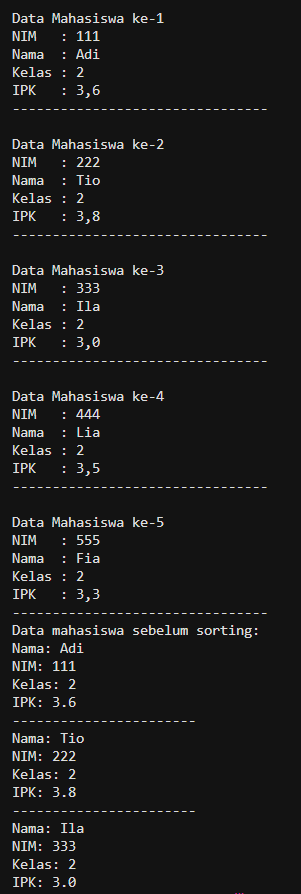
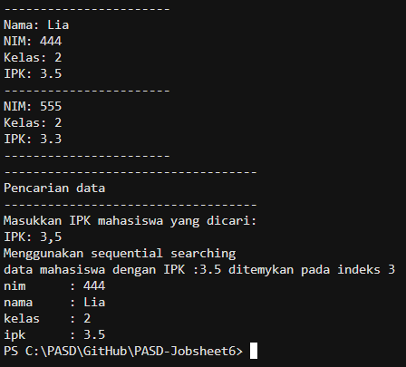

# JOBSHEET 6

# PRAKTIKUM 

## - Praktikum 1 : Searching/Pencarian Menggunakan Algoritma Sequential Search

## - Praktikum 1 : Verifikasi Hasil Percobaan





_Pertanyaan:_

1.  Jelaskan perbedaan metod tampilDataSearch dan tampilPosisi pada class MahasiswaBerprestasi!
2.  Jelaskan fungsi break pada kode program di bawah ini!

    ```java
        if (listMhs[j].ipk == cari) {
                    posisi = j;
                    break;
    ``` 
3. Apa fungsi variabel pos atau indeks hasil pencarian dalam program sequential search?
4.  Jika terdapat lebih dari satu data dengan nilai yang sama, hasil pencarian sequential search yang dibuat di atas akan menampilkan data ke berapa? Jelaskan.
5.  Berkaitan dengan pertanyaan nomor 2 di atas, apa yang terjadi jika perintah break dihapus dari kode di atas?

_Jawaban:_ 

1.  - tampilPosisi ➝ fokus pada letak data (indeks)
    - tampilDataSearch ➝ fokus pada isi/detail data mahasiswa
2.  Fungsi break pada potongan kode tersebut adalah untuk menghentikan perulangan (loop) secara langsung saat data yang dicari sudah ditemukan.
3.  Fungsi variabel pos atau indeks hasil pencarian dalam program sequential search adalah untuk menyimpan lokasi (index) dari data yang ditemukan di dalam array.
4.  Pada kode sequential search yang sudah dibuat, jika terdapat lebih dari satu data dengan nilai IPK yang sama, maka yang akan ditampilkan adalah: data pertama yang ditemukan (indeks paling kecil/paling awal di array)
5.  - Dengan break ➝ ambil data pertama yang ditemukan 
    - Tanpa break ➝ ambil data terakhir yang ditemukan 
    - Tanpa break juga membuat proses lebih lama (kurang efisien)

## - Praktikum 2 : Searching/Pencarian Menggunakan Algoritma Binary Search